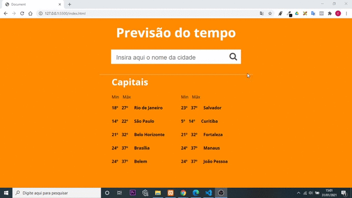

<h1>
    <a>Desafio-Fontend-1STi</a>
</h1>

    

<h3>
    O desafio consiste em criar uma página simples, que consuma a API de previsão do tempo, com objetivo de mostrar os dados de previsão do tempo de uma determinada cidade daqui do Brasil. Este exercício esta presente no repositorio
    <a href="https://github.com/felipefialho/frontend-challenges">frontend-challenges</a>, você pode <a href="https://github.com/felipefialho/frontend-challenges"> visitar</a> para conhecer outros desafios
</h3>
<h4>Estatus do projeto - concluido<h4>
<h4>Tecnologias utilizadas<h4>
<ul>
    <li>Js</li>
    <li>html</li>
    <li>css</li>
</ul>
<h4>API Consumidas<h4>
<ul>
    <li>
        <a href="https://hgbrasil.com/status/weather"> 
            HG Weather API
        </a>
    </li>
</ul>

 Obs: a API do HG Weather API apresenta um limite nuito baixo no numero de consulta que pode ser feito no modo gratis. Existe um arquivo json que pode ser na pasta  js, que pode ser usado para teste, caso exceda o limite de busca fornecido pela API 
